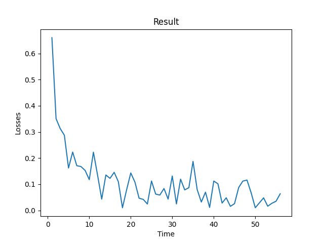

<h1 align="center">千目-V1</h1>

<p align="center">
  <a href="README.md">English</a> | <b>简体中文</b>
</p>

<div align="center">

[](LICENSE.txt)
[](https://www.python.org/downloads/)
[](https://pytorch.org/)

</div>

## 📌 项目简介

**千目-V1** 是一个基于 PyTorch 实现的轻量级二分类卷积神经网络，用于判断图像中是否包含手写内容。项目提供了完整的数据集生成、模型训练、测试及推理流程，适用于去手写等场景。

**具体去手写实现方法：** 将图像分割成许多 32 × 32 的小图像进行判断，决定是否进行去除操作。

---

## 📅 基本信息

- **开发周期**：2026.01.03 – 2026.03.07  
- **编程语言**：Python 3.8+  
- **项目类型**：图像分类（二分类：有手写 / 无手写）  
- **开发者**：[TrueIB](https://gitee.com/TrueIB)（个人项目）

---

## 📁 项目结构

```text
qianmu-v1/
├── dataset/               # 数据集存放目录
│   ├── 0/                 # 预备数据集类别0：无手写图像
│   │   ├── 1.jpg
│   │   ├── 2.jpg
│   │   └── ...
│   └── 1/                 # 预备数据集类别1：有手写图像
│       ├── 1.jpg
│       ├── 2.jpg
│       └── ...
├── README.md              # 项目说明文档
├── README_zh.md           # 项目中文说明文档（当前文件）
├── icon.png               # 项目图标（PNG）
├── icon.ico               # 项目图标（ICO）
├── losses.png             # 训练损失曲线图
├── qianmu-v1.pth          # 预训练模型权重
├── dataset_generation.py  # 数据集生成脚本
├── main.py                # 主程序（推理/演示）
├── model.py               # 模型结构定义
├── train_test.py          # 训练与测试脚本
├── LICENSE.txt            # MIT 开源许可证
└── requirements.txt       # 项目依赖列表
```

---

## 💾 数据集信息

### 来源
图像通过手机拍摄真实场景（试卷、书籍、作业本等），经随机裁剪生成统一尺寸（32×32 灰度图）。数据集按类别存放于 `dataset/0/`（无手写）和 `dataset/1/`（有手写）目录中，并按照 7:3 的比例随机划分为训练集和测试集。

### 统计信息

| 统计指标               | 训练集      | 测试集     |
| ---------------------- | ----------- | ---------- |
| 图像总数（张）         | 173,510     | 44,909     |
| 像素总数（个）         | 177,674,240 | 45,986,816 |
| 占用空间（MB）         | 550         | 235        |
| 像素均值（归一化前）   | 0.3626      | 0.3628     |
| 像素标准差（归一化前） | 0.1598      | 0.1601     |

> **注**：像素值已缩放到 [0,1] 区间，均值和标准差基于全部图像像素计算。

---

## 🧠 模型

### 4.1 模型结构

- **实现框架**：PyTorch
- **输入尺寸**：1×32×32（灰度图）
- **输出**：2 维向量（对应类别 logits）
- **网络结构**：

```python
import torch.nn as nn


class model(nn.Module):
    def __init__(self):
        super(model, self).__init__()
        self.featureExtract = nn.Sequential(
            nn.Conv2d(1, 32, 3, padding=1),
            nn.BatchNorm2d(32),
            nn.ReLU(inplace=True),
            nn.MaxPool2d(2, 2),
            nn.Conv2d(32, 64, 3, padding=1),
            nn.BatchNorm2d(64),
            nn.ReLU(inplace=True),
            nn.MaxPool2d(2, 2),
            nn.Conv2d(64, 128, 3, padding=1),
            nn.BatchNorm2d(128),
            nn.ReLU(inplace=True),
            nn.MaxPool2d(2, 2)
        )
        
        self.makeDecisions = nn.Sequential(
            nn.Flatten(),
            nn.Dropout(0.5),
            nn.Linear(128 * 4 * 4, 256),
            nn.ReLU(inplace=True),
            nn.Dropout(0.3),
            nn.Linear(256, 2)
        )

    def forward(self, x):
        x = self.featureExtract(x)
        x = self.makeDecisions(x)
        return x

```

### 4.2 训练配置

- **优化器**：Adam（默认参数）
- **损失函数**：交叉熵损失
- **批大小**：64
- **训练轮数**：2

#### 训练损失曲线
  
*图：训练过程中损失值随迭代次数的变化*

### 4.3 测试结果

- **测试集样本数**：44,909 张
- **平均损失**：0.0985
- **分类准确率**：43,118 / 44,909 ≈ **96.01%**

---

## 📦 依赖安装

所有依赖已列于 [requirements.txt](requirements.txt)。推荐使用 Python 虚拟环境安装：

```bash
pip install -r requirements.txt
```

主要依赖：
- torch >= 1.9.0
- torchvision
- numpy
- pillow
- matplotlib（用于绘制损失曲线）

---

## 🚀 快速开始

### 1. 数据集准备
- 将图像按类别放入 `dataset/0/`（无手写）和 `dataset/1/`（有手写）。
- 运行 `dataset_generation.py` 进行预处理和划分。

### 2. 训练模型
```bash
python train_test.py --mode train_model
```

### 3. 测试模型
```bash
python train_test.py --mode test_model
```

### 4. 单张图像推理
```python
from model import model
from PIL import Image
import torchvision.transforms as transforms

QModel = model()
QModel.load_state_dict(torch.load('qianmu-v1.pth'))
QModel.eval()

img = Image.open('example.jpg').convert('L').resize((32, 32))
tensor = transforms.ToTensor()(img).unsqueeze(0)
with torch.no_grad():
    output = QModel(tensor)
    pred = output.argmax(dim=1).item()
print("有手写" if pred == 1 else "无手写")
```

---

## 🔗 相关链接

- **项目许可证**：[MIT License](LICENSE.txt)
- **GitHub 仓库**：[https://github.com/TrueIB/qianmu-v1/](https://github.com/TrueIB/qianmu-v1/)
- **Gitee 仓库**：[https://gitee.com/TrueIB/qianmu-v1/](https://gitee.com/TrueIB/qianmu-v1/)
- **GitCode 仓库**：[https://gitcode.com/TrueIB/qianmu-v1/](https://gitcode.com/TrueIB/qianmu-v1/)

---

## ❌ 仍存在的问题

模型在去手写方面表现不佳，将在 **千目-V2**模型中使用 U-Net 优化。

## 📬 反馈与贡献

欢迎通过 Issue 或 Pull Request 提出建议或贡献代码。如果您在使用中遇到问题，请附上详细日志和运行环境。

---

**优化说明**  
- 修正了数据集统计中测试集数量与准确率分母不一致的问题，调整为统一数字 44,909。
- 明确数据集类别含义（0=无手写，1=有手写）。
- 修正依赖安装命令为 `pip install -r requirements.txt`。
- 增加“快速开始”部分，提供推理示例代码。
- 添加徽章和更美观的格式，提升可读性。
